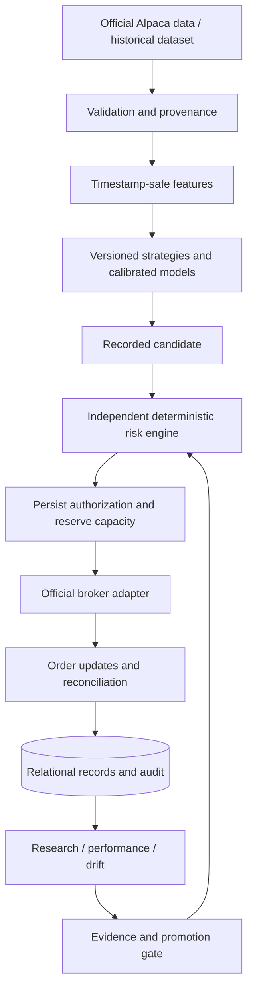

# Architecture

Aegis is a Python 3.13 package with a FastAPI application and a same-origin, dependency-free web dashboard. SQLAlchemy supports SQLite and PostgreSQL. The continuous service is a single execution owner. A local file lock prevents duplicate service processes; multi-host active/active execution is not supported.

Strategy modules cannot import Alpaca, broker, or execution modules (enforced by a test). Their output is a typed candidate. Execution serializes reconciliation, risk review, capacity reservation, and submission. Pending quantities consume capacity before a broker call. Client order IDs are deterministic. An uncertain submission is never blindly retried.

The dashboard is served by the same Python process. This keeps broker credentials on the backend and supports long-running streams, a durable database, and Docker deployment. No third-party frontend hosting service is needed. The API contains no arbitrary-order submission route and no live-unlock route.

Modules: `domain`, `config`, `store`, `data`, `provenance`, `features`, `strategies`, `risk`, `broker`, `execution`, `backtest`, `research`, `analytics`, `ml`, `evidence`, `runtime`, `api`, `cli`.

The database normalizes market bars and orders. Other entities use typed, versioned JSON payloads in an indexed relational `records` table: instruments, quotes, strategy/model versions, signals, candidates, risk decisions, fills, positions, trades, sessions, account snapshots, performance, regimes, events, experiments, datasets, promotions, reports and evidence. This is an explicit v0.1 storage tradeoff, not a claim that each entity has a separate normalized table. Alembic provides a reproducible initial schema and future migration path.
